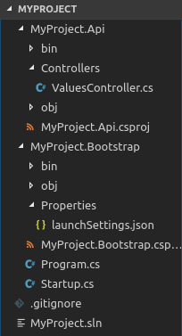

# ASP.NET Core Web API Slim template

Template for ASP.NET Core project based on built-in web template.

This template create a solution with two separate projects:
- The *.Bootstrap* project with *Program.cs* and *Startup.cs* files.
- The *.Api* project for the Controllers.  

Also the packages referenced by those projects are the minimum required to run the application instead of make use of the *Microsoft.AspNetCore.App* package.

You can check the .csproj files to know what are these packages.

## How to use it

- Clone this repository
- Install the template
```
dotnet new -i ./AspnetWebApiSlimTemplate
```
- Now you can see a new template in the list called *ASP.NET Core Web API Slim*
- Create a new project
```
dotnet new webapislim -o MyProject
```
- On this process the NuGet packages will restore automatically, so you will see the related messages on the console.
```
The template "ASP.NET Core Web API Slim" was created successfully.

Processing post-creation actions...
Running 'dotnet restore' on MyProject/MyProject.Bootstrap/MyProject.Bootstrap.csproj...
  Restoring packages for /home/davamix/Development/dotnet/D/MyProject/MyProject.Api/MyProject.Api.csproj...
  Restoring packages for /home/davamix/Development/dotnet/D/MyProject/MyProject.Bootstrap/MyProject.Bootstrap.csproj...
  Generating MSBuild file /home/davamix/Development/dotnet/D/MyProject/MyProject.Bootstrap/obj/MyProject.Bootstrap.csproj.nuget.g.props.
  Generating MSBuild file /home/davamix/Development/dotnet/D/MyProject/MyProject.Api/obj/MyProject.Api.csproj.nuget.g.props.
  Generating MSBuild file /home/davamix/Development/dotnet/D/MyProject/MyProject.Bootstrap/obj/MyProject.Bootstrap.csproj.nuget.g.targets.
  Generating MSBuild file /home/davamix/Development/dotnet/D/MyProject/MyProject.Api/obj/MyProject.Api.csproj.nuget.g.targets.
  Restore completed in 217.51 ms for /home/davamix/Development/dotnet/D/MyProject/MyProject.Bootstrap/MyProject.Bootstrap.csproj.
  Restore completed in 217.51 ms for /home/davamix/Development/dotnet/D/MyProject/MyProject.Api/MyProject.Api.csproj.

Restore succeeded.
Running 'dotnet restore' on MyProject/MyProject.Api/MyProject.Api.csproj...
  Restore completed in 29.63 ms for /home/davamix/Development/dotnet/D/MyProject/MyProject.Api/MyProject.Api.csproj.

Restore succeeded.

```

- This is the project structure



- You can run the site with `dotnet run` from MyProject.Bootstrap folder and navigate to https://localhost:5001/api/values

- If all works fine you can see the values on your browser, if you can't see them... fix the errors :-P
